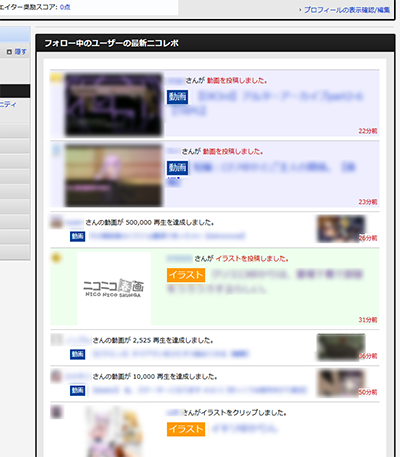

# SmartNicoRepo
ニコニコ動画のニコレポを改良します．

## インストール

* [安定板ダウンロード]() 

UserScriptが実行できる環境が必要です．  
GreasemonkyやTamperMonkeyなどを導入し，上のリンクへ飛ぶとインストールダイアログが出ます．

> * [ベータ版]() 
> * [アルファ版]() 
>
> 新しい機能が使えますが，不安定で問題が起きる可能性が高くなります．

## 使い方

準備中

## 既知の問題

* 想定以上の速さでスクロールした時の動作が不明

## 将来的に実装予定

* タブで静画系や生放送一覧に切り替えられる
* ダークテーマ
* 1週間以上前のニコレポをも表示
* ページ遷移せず静画をポップアップする
* どこまで見たかの栞機能

## 問い合わせ・バグ報告・要望・感想など

> [@yukawallstudio](https://twitter.com/)
